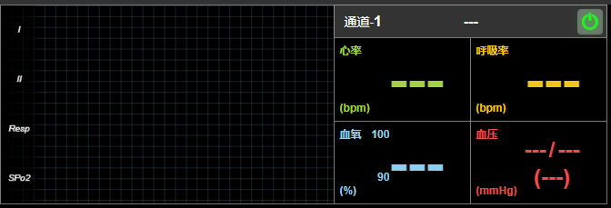

## 监护仪组件使用文档（MonitorSimple.vue）
2022-01-19 by libs

#### 组件功能
>1. 兼容多个厂家的监护仪，可适配各常见监护仪数据
>1. 自适应/可配置的样式，满足现有监护仪（实时心电图）页面的表现需求
>1. 使用方便

***
#### 引入组件
>在vue项目的页面中引入：
``` javascript
import MonitorSimple from "./MonitorSimple.vue"
export default {
    components:{MonitorSimple}
}
```
>在该页面的模板template中即可使用本组件：
``` html
    <template>
        <div>
            <MonitorSimple ref="monitor-simple" :option="monitorOpt"></MonitorSimple>
        </div>
    </template>
```
***
#### 组件参数props
> 当前组件参数props主要有2个
> - channel：通道号，当业务逻辑需要同时存在多个监护仪组件时，可传入一个唯一的通道号作为标识，如果配置项设置了显示生命体征信息栏，通道号将在信息栏左上角显示出来。传入的通道号可以作为监护仪的唯一判断，在部分事件触发时，该通道号将作为事件参数返回上层。如果业务逻辑无此需求，可不传。
> <font color="F56C6C" size='3'>另外，关于唯一值判断，还有一个是患者的id。这需要在数据逻辑中，将患者数据和波形数据一起推送进来，详情可参考“组件方法：pushData”的说明。患者信息如果存在，也会在组件事件中回传。</font>
> - option：配置选项，可配置监护仪组件的各种样式与表现，并且包含了指定波形展示的waveNames项，因此props:option配置是必须的。不过，option内部的配置项则大多数都是有默认值的。具体参考“选项与配置”的说明。

***
#### 选项与配置
>选项与配置通过props:option传入，

###### <font color="#409EFF">options.waveNames</font>
>数组，传入需展示的波形名，与波形数据中的<font color="#333"><b> name </b></font>属性对应，否则无法展示，例如：
``` javascript
    {
        waveNames:['I','II','RESP','SPo2'] // 将展示这4个波形
    }
```
>传入数据时，<font color="#333"><b> name </b></font>属性与之对应，以下为某波形数据示例：
``` javascript
    waves:[
        {
            name:"I", // 波形名，必须与配置option.waveNames中的值保持一致
            data:[], // 波形数据
            pointPerWave:250, // 该波形数据，每秒的点数（因不同厂家的监护仪、不同的波形而异）
            style:{ // 非必须，可单独设置波形样式（线宽，颜色,透明度）,优先级比option.waves.wave中的配置更高
                lineWidth:1,
                color:'#a3d148',
                opacity:1
            }
        }
    ]
```
><font color="#999">关于数据的传递形式，后续在组件方法说明中详细说明</font>  

###### <font color="#409EFF">options.showWaveOnly</font>
>布尔值，配置组件是否只展示波形区，默认为true。如果传入false，则组件除了展示波形区，还将在右侧展示生命体征信息，例如：
``` javascript
    {
        showWaveOnly:false
    }
```
>结果:



###### <font color="#409EFF">options.showPowerBtn</font>
>布尔值，是否展示电源按钮，电源按钮位于组件右上角，可操作"监护仪组件"的启动和关闭，如果希望用户可以手动启动和关闭组件，则该配置可设置为true，将按钮显示出来。通常开发中，动态改变组件的启动状态应调用组件方法来达成，详见组件方法的 _powerOn_ 和 _powerOff_ 方法

###### <font color="#409EFF">options.style</font>
>组件的整体样式配置，可配置组件的宽、高、背景色、边框等样式。**css**样式名采用驼峰写法，示例：
``` javascript
    var option = {
        style:{ // 配置基本样式，背景色、边框、宽高等
            backgroundColor:"#000", // 配置组件背景色（默认#333）
            border:"1px solid #aaa", // 配置组件边框样式，默认“none”
            grid:{ // 生命体征信息区栅格样式
                lineWidth:1, // 线宽
                color:'rgba(240,240,240,0.4)',  // 颜色
                opacity:0.5,  // 透明度
                type:'solid' // 默认"solid"
            }
        }
    }
```
><font color="#F56C6C" size='2'>grid生命体征信息栅格区域，需在 _options.showWaveOnly_ 配置为false时才出现</font> 

###### <font color="#409EFF">options.waves</font>
>配置组件的波形区的样式，具体又分为4部分，示例和说明如下：
``` javascript
var option = {
    waves:{ // 示波区样式配置
        grid:{ // 栅格，这里指示波区的背景方格样式配置，注意与 option.style.grid 配置所指不同。
            show:false, // 是否展示背景方格
            lineWidth:0.5, // 方格的线宽
            color:'#fff', // 颜色
            opacity:0.2, // 透明度
            cell:10, // 栅格单元格大小（px）
        },
        wave:{ // 波形相关配置
            lineWidth:1,  // 波形的线宽
            color:'#fff', // 波形的颜色
            opacity:1 // 透明度
        },
        nameStyle:{ // 波形名样式，即option.waveNames配置的波形名展示在组件上的样式
            font:'italic normal 10px arial,sans-serif', // 字体设置
            color:'#fff', // 字体颜色
            cover:true, // 是否遮盖下层内容（如有栅格，且设置了cover，这波形名位置遮盖栅格线）
            width:40, // 占宽度
        },
        splitLine:{  // 波形分隔线，设置波形之间的分隔线，
            show:false, // 默认不展示
            lineWidth:2, // 线宽
            color:'#fff', // 颜色
            style:'solid' // 线条风格（solid/dotted/dashed）
        }
    }
}
```
><font color="#409EFF">*以上配置，基本涵盖了组件各部分的展示状态和样式，灵活进行配置，基本能满足组件在各种页面中的样式表现。绝大多数配置项都有默认值，只有 option.waveNames与波形数据关联，是必须传入的。 以下是一个全配置的示例*</font>

``` javascript
var option = { // 默认配置
    waveNames:[/* 'I','II','RESP','SPo2' */], // 须展示的波形名,需与数据中的波形name对应，否则无法展示波形,必须传入
    showWaveOnly:true, // 是否只展示波形区
    showPowerBtn:true, // 是否展示电源按钮
    style:{
        backgroundColor:"#333",
        border:"none",
        width:"100%",
        height:"100%",
        grid:{ // 生命体征信息区栅格样式,showWaveOnly=true只展示波形区时，该信息区不展示，该配置无意义，仅当showWaveOnly=false时该配置有效
            lineWidth:1,
            color:'#fff',
            opacity:0.5,
            type:'solid'
        }
    },
    waves:{ // 示波区样式配置
        grid:{ // 栅格
            show:false,
            lineWidth:0.5,
            color:'#fff',
            opacity:0.2,
            cell:10, // 栅格单元格大小
        },
        wave:{ // 波形相关配置
            lineWidth:1,
            color:'#fff',
            opacity:1
        },
        nameStyle:{ // 波形名
            font:'italic normal 10px arial,sans-serif', // 字体设置
            color:'#fff', // 字体颜色
            cover:true, // 是否遮盖下层内容（如有栅格，且设置了cover，这波形名位置遮盖栅格线）
            width:40, // 占宽度
        },
        splitLine:{
            show:false,
            lineWidth:2,
            color:'#fff',
            style:'solid'
        }
    },
},
```
***

#### 组件方法
>组件提供了一些方法，通常情况下组件方法有两种，一种是以 __ 双下划线开头的方法，这种方法通常是指组件内部的方法，不推荐使用者调用（当然你仍然可以调用,但某些情况下可能会出错）；另一种不以 __ 开头的方法，则是组件提供给使用者调用的方法。


>例如
>在页面中引入并使用了组件：
``` html
    <MonitorSimple ref="monitor-simple" :option="monitorOpt"></MonitorSimple>
```
>则在页面的业务逻辑中，可调用组件的方法如下：
``` JavaScript
    let monitor = this.$refs['monitor-simple'] ; // 获取组件实例
    monitor.powerOn() ; // 调用组件的“启动”方法
```
>目前组件推荐调用的方法如下：
>- getRunningState
>- powerOn
>- powerOff
>- pushData
>- msgShow
>- msgHide


###### <font color="#409EFF">方法：getRunningState</font>
>该方法用于获取当前组件的运行状态，如果组件正在运行中（执行了 _powerOn_，且未执行 _powerOff_）,则返回true，否则返回false。
###### <font color="#409EFF">方法：powerOn</font>
>组件启动运行的方法，执行该方法，组件的运行状态转变为true，各项配置将初始化。当组件初始化完成后，将触发启动完成事件“_powerOnComplete_”。如果展示了电源按钮（详见选项与配置:_option.showPowerBtn_），在组件未启动时，若用户点击电源按钮，则将启动组件运行，实际就调用了该方法。因此，点击电源按钮启动，与动态调用该方法本质是一样的。

> 如果组件未执行过 _powerOn_ 进行启动，则无法向组件推送监护仪数据（控制台抛出错误），详见方法 _pushData_ 的说明。

> _powerOn_ 方法将更新并应用组件的配置项，如果业务过程中需要更改部分配置的，建议可以执行 _powerOff_ 关闭组件，再执行 _powerOn_ ，使组件“重启”。
###### <font color="#409EFF">方法：powerOff</font>
>组件停止运行的方法，执行该方法，组件运行状态转为false，所有数据重置，波形的显示与绘制也将停止（关闭定时器）。然后触发事件“_powerOffDone_”事件。该事件表示组件在逻辑上已完成了“关闭”，但由于组件关闭存在过渡动画，在视觉上仍未关闭，而是在一定时间后逐渐隐藏，最终达到完全关闭。当组件完全关闭时，将触发事件“_powerOffComplete_”

> 组件在自身生命周期的“销毁前”，执行了 _powerOff_ 方法。

###### <font color="#409EFF">方法：pushData</font>
>推送数据的方法，执行该方法前，首先要“启动”组件。

>关于数据的管理：由于监护仪数据需要实时改变，并不断处理、绘制、删除数据，因此，数据的维护和管理交给监护仪内部逻辑会是一个更好的选择。而传递数据的方式，本组件采用了方法推送的方式，而不采用props传递的形式（props传递的形式本质上仍然是父级在维护和管理数据）

>数据需要满足一定的格式，以下为一个数据传递的例子：
```JavaScript
    let data = {
        patient:{ // 患者信息
            name:"张三", // 展示用, 如果需要展示信息区（showWaveOnly=false），则患者姓名将展示在该位置
            id:'1234567890123' , // 唯一值，监护仪部分事件触发时，返回给上层
        },
        base:{ // 基本生命体征数据，如果配置项 showWaveOnly 值为true，则不展示生命体征信息，该数据可不传
            hr:62,// 心率
            rr:15, // 呼吸率
            spo2:97, // 血氧饱和度
            sbp:120, // 收缩压（高压）
            dbp:80, // 舒张压（低压） // 平均动脉压由组件根据高压、低压的值自行计算，不需要传入（ 公式：平均动脉压 = (高压+2*低压)/3 ）
        },
        waves:[ // 波形数据（数组）
            {
                name:"I", // 波形名，必须与配置option.waveNames中的值保持一致
                data:[126,128,128,130,131,132,134,135,136,137,138,139,139,140,141,142,143,143,143,144,144,144,144,144,143,142,141,140,139,137,137,136,134,133,131,130,128,127,126,125,125,125,125,125,125,125,125,125,125,125,125,125,125,125,125,125,125,125,125,125,125,125,125,125,125,125,125,125,125,125,125,125,125,125,125,125,125,125,125,125,125,125,125,125,125,125,125,125,125,125,125,125,125,125,125,125,125,125,125,125,125,125,125,125,125,125,125,125,125,125,125,125,125,125,125,125,125,125,125,125,125,125,125,125,125,125,125,125,125,125,125,125,125,125,125,125,125,125,125,125,125,125,125,125,125,125,125,125,125,125,125,125,125,125,125,125,125,125,125,125,126,127,129,131,131,132,133,134,135,135,135,135,134,133,132,131,130,128,127,125,125,125,125,125,125,125,125,125,125,125,125,125,125,125,125,125,125,125,125,125,125,124,123,122,120,118,121,133,144,155,165,176,180,170,159,148,137,126,118,119,121,122,124,124,125,125,125,125,125,125,125,125,125,125,125,125,125,125,125,125,125,125,125,125,125,125,125,125,125,125], // 波形数据
                pointPerWave:250 , // 每秒的点数（不同牌子的监护仪，不同的波，可能都不同）,该值必传
                style:{ // 非必须，波形样式（线宽，颜色,透明度）,优先级比option.waves.wave中的配置高，这里可单独设置一个波的样式
                    lineWidth:1,
                    color:'#a3d148',
                    opacity:1
                }
            },
            {
                name:"II", // 波形名，必须与配置option.waveNames中的值保持一致
                data:[126,127,127,129,129,130,131,132,132,133,134,135,135,135,136,136,137,137,137,138,138,138,138,137,137,136,136,135,135,133,133,133,131,130,129,129,127,126,126,125,125,125,125,125,125,125,125,125,125,125,125,125,125,125,125,125,125,125,125,125,125,125,125,125,125,125,125,125,125,125,125,125,125,125,125,125,125,125,125,125,125,125,125,125,125,125,125,125,125,125,125,125,125,125,125,125,125,125,125,125,125,125,125,125,125,125,125,125,125,125,125,125,125,125,125,125,125,125,125,125,125,125,125,125,125,125,125,125,125,125,125,125,125,125,125,125,125,125,125,125,125,125,125,125,125,125,125,125,125,125,125,125,125,125,125,125,125,125,125,125,126,126,127,129,129,130,130,131,132,132,132,132,131,130,130,129,129,127,127,125,125,125,125,125,125,125,125,125,125,125,125,125,125,125,125,125,125,125,125,125,125,125,124,123,122,121,122,130,137,145,152,159,162,155,148,140,133,126,120,121,122,123,125,125,125,125,125,125,125,125,125,125,125,125,125,125,125,125,125,125,125,125,125,125,125,125,125,125,125,125], // 波形数据
                pointPerWave:250 , // 每秒的点数（不同牌子的监护仪，不同的波，可能都不同）
                style:{ // 非必须，波形样式（线宽，颜色,透明度）,优先级比option.waves.wave中的配置高，这里可单独设置一个波的样式
                    lineWidth:1,
                    color:'#a3d148',
                    opacity:1
                }
            },
            {
                name:"Resp", // 波形名，必须与配置option.waveNames中的值保持一致
                data:[117,117,118,118,118,119,119,119,120,120,120,121,122,122,122,122,122,123,124,124,124,125,125,125,126,126,126,127,127,128,128,128,129,130,130,130,131,131,132,132,132,133,133,133,134,135,135,136,136,136,137,138,138,139,139,139,140,141,141,142,142,142,143,144,144,144,145,145,146,146,146,147,148,148,149,149,149,150,150,150,151,152,152,153,153,153,154,154,154,155,155,155,156,156,156,157,157,157,158,158], // 波形数据
                pointPerWave:100 , // 每秒的点数（不同牌子的监护仪，不同的波，可能都不同），本模拟数据是宝莱特的呼吸率，每波点数是100
                style:{ // 非必须，波形样式（线宽，颜色,透明度）,优先级比option.waves.wave中的配置高，这里可单独设置一个波的样式
                    lineWidth:1,
                    color:'#efc519',
                    opacity:1
                }
            },
            {
                name:"SPo2", // 波形名，必须与配置option.waveNames中的值保持一致
                data:[72,68,64,62,62,60,60,58,58,60,62,64,66,66,68,68,70,66,66,68,68,70,68,68,66,66,64,64,62,60,58,56,54,54,52,50,48,48,46,44,42,40,38,36,34,34,32,32,30,30,28,26,24,24,22,20,18,18,16,14,12,12,10,10,8,8,6,6,4,4,2,2,0,0,0,0,0,0,0,0,0,2,6,12,20,28,38,48,58,70,80,90,100,110,118,128,136,146,154,162], // 波形数据
                pointPerWave:100 , // 每秒的点数（不同牌子的监护仪，不同的波，可能都不同），本模拟数据是宝莱特的血氧饱和度，每波点数是100
                style:{ // 非必须，波形样式（线宽，颜色,透明度）,优先级比option.waves.wave中的配置高，这里可单独设置一个波的样式
                    lineWidth:1,
                    color:'#8bd1f0',
                    opacity:1
                }
            },
        ]
    }

    monitor.pushData(data) ; // 组件实例调pushData方法，推送该数据
```
>页面业务逻辑定时获取数据，处理成该结构，通过pushData方法推送给组件。

>关于数据中传递的 _pointPerWave_ 属性，不同厂家的监护仪，该值会有所不同。同一个监护仪，不同的波，该值也会有不同，例如宝莱特监护仪，心电数据标准是每秒约250个点，而呼吸、血氧的波，则是约每秒100个点，该标准值应在业务逻辑中判断并传入组件。而组件获取到该值，实际绘制波形时，只是将该值作为参考值（实际监护仪数据并不一定严格每秒推送该数量的点，因此如果绘制波形时严格按照该值执行，可能会出现数据不足的问题）。

>data.waves波形数据中，每一组都可单独配置style，可实现每个波不同样式展示。如果不传该配置，则波形的样式将按照统一的option.waves.wave的样式配置进行绘制。

###### <font color="#409EFF">方法：msgShow</font>
>展示提示信息的方法，有3个参数：text,type,duration。
> - text:需要提示的文字信息
> - type:提示的类型，接受3种：'info'-一般信息提示；'warning'-警告信息提示；'error'-错误信息提示，非必须，默认为类型'info'。
> - duration:延迟时间，毫秒。延迟该时间将自动关闭，非必须，默认3000；如显式传入0，则该消息不会自动关闭，如需关闭，需要执行msgHide方法手动关闭。

###### <font color="#409EFF">方法：msgHide</font>
>当存在“非自动关闭”的消息提示时，需要手动关闭，可执行该方法。

*** 
#### 组件事件
> 通常情况下，大多数逻辑都在组件内部处理，外部业务逻辑则只需要关注组件的“运行状态”，并不断“推送”数据给组件即可。因此，大多数时候组件不需要暴露太多的事件回调。目前组件提供了3个事件的回调，都和组件的“运行”情况有关。
> - **powerOnComplete**: 该事件在组件启动成功，所有配置应用完成后触发。标识了组件当前处于“运行中、ready”的状态。返回组件的channel通道号。如果没有则返回undefined。
> - **powerOffDone**: 该事件在组件关闭，并清除旧数据、旧配置后触发，标识了组件当前处于“关闭”的状态。返回组件的channel通道号和患者信息。
> - **powerOffComplete**: 该事件在组件“完全关闭”后触发。组件的关闭，除了逻辑上、数据和配置的清除之外，还在视觉上存在过渡动画，该事件在组件“逻辑关闭”后，等待过度动画完成后触发，因此该事件必然在 _powerOffDone_ 之后触发。总的来说 _powerOffDone_ 是逻辑关闭， _powerOffComplete_ 是“视觉关闭”、“完全关闭”。该事件返回值与 _powerOffDone_ 相同。