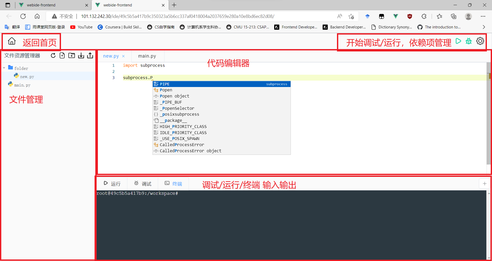
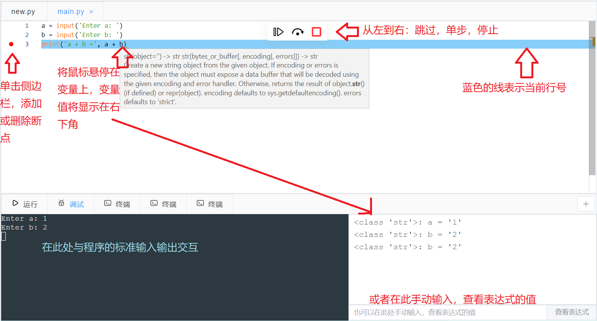

# 使用文档

[TOC]

## 部署

可以跳过部署，使用我们在开发服务器上部署好的版本：[http://101.132.242.30](http://101.132.242.30)。

开发服务器将于2022年9月5日 23:00:00过期，如果需要在9月5日之后使用或是遇到其它问题，请联系jx-he19@mails.tsinghua.edu.cn，或者麻烦您在课程群加“和嘉晅”同学的微信。

### 使用Docker-Compose自动部署

- 安装Docker与Docker Compose
  - 已经有WSL2的Windows可以直接安装Docker Desktop ：[Install Docker Desktop on Windows | Docker Documentation](https://docs.docker.com/desktop/install/windows-install/)
  - 其它平台可以参考：[Install Docker Engine | Docker Documentation](https://docs.docker.com/engine/install/)

- 拉取部署仓库与前后端子模块：`git clone --recursive git@github.com:frontend-backend-project-2022/deploy.git`
- （如果部署在服务器而非localhost）修改根目录下的`.env`文件，将`BASE_URL`与`VUE_APP_BASE_URL`改为部署的服务器的URL
- 运行`docker compose up -d`，服务将运行在80端口（可能需要等待较长时间）

### 手动启动开发服务器（不推荐）

- 由于后端需要与Docker交互，仍需要先安装Docker
- 分别拉取前后端仓库
  - 前端：[frontend-backend-project-2022/frontend (github.com)](https://github.com/frontend-backend-project-2022/frontend)
  - 后端：[frontend-backend-project-2022/backend (github.com)](https://github.com/frontend-backend-project-2022/backend)
  - （可选）文档仓库：[frontend-backend-project-2022/doc (github.com)](https://github.com/frontend-backend-project-2022/doc)

- 启动前端开发服务器
  - 安装依赖：`yarn install`
  - 启动：`yarn serve`

- 启动后端开发服务器
  - 安装依赖：`pip install -r requirements.txt`
  - 启动：`flask run`

## 使用

### 登录/注册

访问网站，首先看到登录页面，需要先点击“立即注册新账号”创建一个新账号。

输入用户名，密码创建账号：

注册成功后返回登录界面，输入用户名和密码登录，跳转到主页。

### 管理工程

在主页可以管理工程（查看、创建、重命名、删除），退出登录，或跳转到IDE页面，如下图所示：

### IDE页面

点击一个工程跳转到IDE页面。该页面的功能分区如下图：

#### 文件管理区

#### 代码编辑器

#### 可交互终端

#### 运行

#### 调试

#### 依赖项管理

点击右上角的“设置”图标打开依赖项管理。

