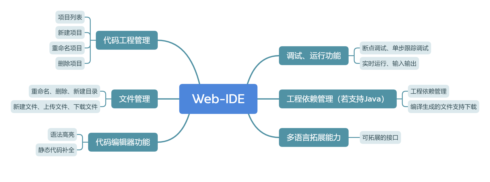
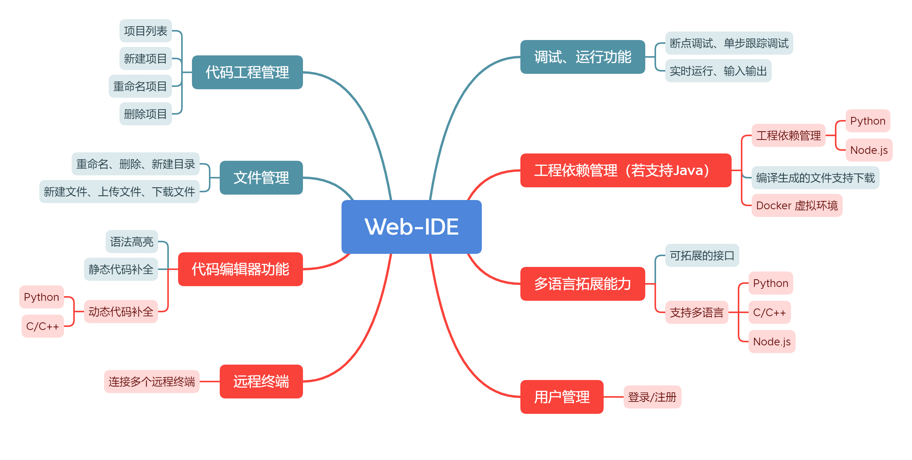
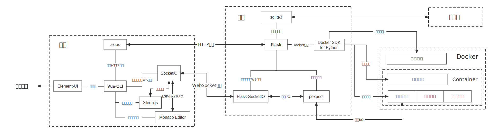
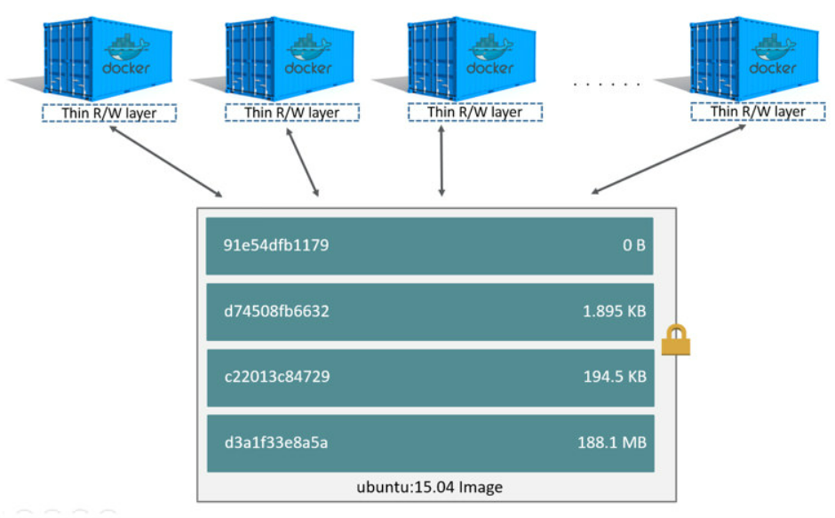

# 设计文档

[TOC]

## 需求分析

按照助教给出的作业文档，以及对已有在线IDE的前期调研，将需求划分为代码工程管理、文件管理、代码编辑器、调试运行、工程依赖、多语言拓展能力6个模块，如下图：

最终完成的基础功能（墨绿色）与额外功能（红色）：

## 项目架构

整体上分为前端、后端、数据库、Docker 4个模块。

[打开图片](assets/项目架构.svg)

### Docker

Docker是该项目架构的核心。我们使用Docker Container来保存并管理工程：借助Docker创建虚拟环境，使得每个工程具有一个独立的Container。

- 用户可以选择的初始代码环境（包括语言与版本）被抽象为Docker镜像
  - 这些Docker镜像被预先构建，并用`--tag web-ide/{name}`标记，方便后端查找
  - 例如：用户想要创建一个Python工程，在前端界面中发现我们提供Python 3.8，Python 3.9，Python 3.10这3种Python环境，于是选择Python 3.8。后端收到创建Python 3.8工程的请求后，从预先构建好的镜像列表中寻找名为`web-ide/python:3.8`的镜像，使用该镜像创建一个Container
  - 由于镜像已经预先构建好，创建Container的速度是很快的
- 这些Docker镜像使用`Dockerfile`进行自定义，满足项目中的各种需求
  - 例如：[GCC的官方镜像](https://hub.docker.com/_/gcc)没有`gdb`和`gdbserver`，而后端实现调试功能需要用到，因此需要从官方的GCC镜像开始，`RUN apt-get -y install gdb && apt-get -y install gdbserver`
- 由于Docker Container只是在镜像上加了一个可写层，每个Container共享Image中的环境，因此对内存资源的占用是较少的。

### 前端

前端以Vue-CLI为核心

- 用户界面：使用Element-Plus组件库，完成除去代码编辑器与远程终端以外的所有用户界面
- 与后端通信：分为HTTP协议与WebSocket协议
  - 使用axios发送异步HTTP请求，完成常规的增删改查工作
  - 使用Socket.IO与服务器进行实时性较强的WebSocket通信
    - Socket.IO是对WebSocket协议的一层包装，相比于原始的WebSocket协议，Socket.IO支持事件驱动的通信，并可以通过`namespace`模块化代码。
    - 可交互终端、代码编辑器、调试器，都采用了Socket.IO与后端通信。
- 代码编辑器：[Monaco Editor](https://microsoft.github.io/monaco-editor/)
  - VS Code使用的代码编辑器，支持[Language Server Protocol](https://microsoft.github.io/language-server-protocol/)（下简称LSP）

- 可交互终端：[Xterm.js](https://xtermjs.org/)
  - 同样使用Socket.IO与后端的接口对接

- 调试/运行：使用Element-Plus组件编写界面，使用Socket.IO与后端的接口对接

### 后端

后端以Flask为框架，处理前端的HTTP请求和WebSocket请求，与数据库交互，并管理Container中的各种进程。

- 对于HTTP请求的项目、文件等内容，后端通过访问数据库和docker对数据进行增、删、改、查
- 实时交互的功能：产生子进程，通过Socket.IO进行数据通信
  - 包括：语言服务，终端，调试/运行
  - 产生子进程：使用`subprocess.Popen`，并连接到子进程的标准输入输出

- 调试
  - 针对Python的`pdb`与C++的`gdb`的具体输入输出实现，在Socket.IO中暴露一套语言无关的接口
  - 借助pexpect读取分析终端输出的内容

### 数据库

利用轻量级关系型数据库SQLite，建立用户表和项目表两张表，其中用户与项目是一对多的关系。

## 功能实现

### 代码工程管理

**前端**：实现页面（页面设计见使用文档），向后端发送HTTP请求

**后端**：对数据库增删查改，并编写API文档

- 数据库中需要记录项目基础信息、创建的用户、以及Container ID
- 特别的，创建/删除工程时，需要创建新的Container或是删除对应的Container

### 文件管理

**前端**：实现页面（页面设计见使用文档），向后端发送HTTP请求

- 将Container ID存在URL中，通过Vue-Router实现的动态路由，从`this.$route.params`中获取Container ID

**后端**：收到前端的请求后，根据Container ID，在对应的Container中执行对应的指令

- 删除文件/目录：`rm`
- 重命名文件/目录：`mv`
- 新建文件：`touch`
- 新建文件夹：`mkdir`
- 上传/下载
  - 用Body与前端互相传输文件
  - 用`tar`压缩包与Docker Container互相传输文件：使用Docker Python SDK中Container的`put_archive/get_archive`函数

### 代码编辑器功能

**前端**：界面设计见使用文档

- 将编辑器抽象为一个Vue Component
- 查看代码：使用Monaco Editor，使用[createModel](https://microsoft.github.io/monaco-editor/api/modules/monaco.editor.html#createModel)对每个打开的文件建立`TextModel`，使用[setModel](https://microsoft.github.io/monaco-editor/api/interfaces/monaco.editor.IStandaloneCodeEditor.html#setModel)为Monaco Editor挂载显示的文件
- 切换不同文件：用`el-tabs`在编辑器上方编写一个标签页，显示所有打开的文件与当前显示的文件，切换标签页时，使用`setModel`挂载另一个`TextModel`即可
- 语法高亮：根据[createModel](https://microsoft.github.io/monaco-editor/api/modules/monaco.editor.html#createModel)的文档，当`language`留空时将根据`url`自动推导，因此只需要在`url`传入正确的文件名，就可以激活Monaco Editor对不同语言内置的高亮
- 动态代码补全
  - 由于Monaco Editor支持LSP，因此只需要按照LSP中描述的Json-RPC标准将Monaco Editor与后端的语言服务器对接，即可支持动态代码补全、代码提示、格式化等功能
  - 最终对接了C++和Python的语言服务器
    - Python：[palantir/python-language-server: An implementation of the Language Server Protocol for Python (github.com)](https://github.com/palantir/python-language-server)
    - C++：[What is clangd? (llvm.org)](https://clangd.llvm.org/)
  - 对接的代码参考了[TypeFox/monaco-languageclient: NPM module to connect Monaco editor with language servers (github.com)](https://github.com/TypeFox/monaco-languageclient)
    - 在此之上，根据Monaco Editor的`IWebSocket`接口，将其中的通信方式从WebSocket更改为Socket.IO

**后端**

- 提供两个API，支持前端查看文本文件内容，以及保存内容到文本文件

### 调试/运行

**前端**：界面设计见使用文档

- 使用[deltaDecorations](https://microsoft.github.io/monaco-editor/api/interfaces/monaco.editor.IStandaloneCodeEditor.html#deltaDecorations)为Monaco Editor的特定行（调试当前运行到的行）与行侧边栏（断点）添加`class`，然后使用CSS添加蓝色矩形（调试当前运行到的行）与红色圆（断点）
- 用props暴露`lineNumber`与`breakPointList`两个响应式数据接口，IDE页面只需要更改数据即可控制调试UI的行为
- 用`this.$emit`向父组件传递调试事件。事件列表：
  - `skip`：“跳过”按钮被单击
  - `step`：“单步”按钮被单击
  - `stop`：“停止”按钮被单击
  - `newBreakpoint(lineNumber)`：特定行的侧边栏被单击（对应创建/删除断点）
  - `wordHover(word)`：鼠标悬浮在单词`word`上（对应查看变量的值）
- IDE页面使用Xterm.js创建一个终端，允许用户和被调试程序的标准输入输出交互
- IDE页面用一套语言无关的Socket.IO接口与后端的调试器通信

| 前端发起的事件 | 描述 | 后端发起的事件 | 描述 |
| -------------- | ---- | -------------- | ---- |
|        `start`        | 开始调试 | `initFinished` | 调试器已经启动 |
|      `add(lineno)`          | 添加断点 | `addListFinished` | 成功添加初始断点 |
|   `addList(linenoList)`             | 添加初始断点列表 | `response(res)` | 大部分前端事件结束后触发，`res`中包含当前行号与断点列表等信息 |
|      `delete(lineno)`          | 删除断点 | `stdout(message)` | 程序的标准输出新增了`message` |
|    `skip`            | 跳过 |  |  |
|      `next`          | 单步 |                |      |
|     `check(expression)`           | 查看表达式 |                |      |
|     `stdin(message)`     | 发送`message`到程序的标准输入 |                |      |
|      `exit`          | 停止调试 |                |      |

**后端**

- 按照Socket.IO接口与具体的调试器交互
  - Python：`pdb`
  - C++：`gdb`
- 为了使调试器与被调试程序的输入输出分离开，使用`remote-pdb`代替`pdb`，使用`gdbserver`代替`gdb`，然后在另一个进程中使用`telnet`连接到`remote-gdb`或`gdbserver`
  - 这样运行`remote-gdb`或`gdbserver`的线程接受被调试程序的标准输入输出，而运行`telnet`的线程接受调试器的输入输出
  - 需要修改`Dockerfile`，安装`remote-pdb`, `gdbserver`与`telnet`
- 为了与调试器交互，使用`pexcept`库等待进程标准输出，直到标准输出满足特定的正则表达式，然后找出其中包含的文件名与行号信息
  - 例如PDB在“跳过”完成时会输出类似于`> /mnt/c/Users/j31234/Desktop/1.py(3)<module>()`的信息
  - 我们使用正则表达式`r"> ([^ ]*|<[^<>]*>)\((\d+)\)[<\w>]+\(\)"`结合`pexcept`等待这种模式出现在PDB的标准输出中
  - 匹配到这种模式后，第1个group为文件的绝对路径，第2个group为行号

### 工程依赖管理

由于每个工程都使用Docker Container提供了非常纯净的虚拟环境，用户可以直接在远程终端里用`pip`或者`yarn`管理工程依赖。当然，我们也在用户界面上也提供了简单的工程依赖管理功能。

**前端**：界面设计见使用文档

**后端**：在Docker中执行`pip`或者`yarn`指令

### 多语言拓展能力

我们的项目支持Python，C++与Node.js，支持功能表如下：

|                                         | 编译/运行环境 | 语法高亮 | 动态代码补全 | 运行 | 调试 | 依赖管理 |
| --------------------------------------- | ------------- | -------- | ------------ | ---- | ---- | -------- |
| Python                                  | √             | √        | √            | √    | √    | √        |
| C / C++                                 | √             | √        | √            | √    | √    |          |
| Node.js                                 | √             | √        | √            | √    |      | √        |
| 常见文本文件（json, Dockerfile, yml等） |               | √        | √            |      |      |          |

不仅如此，可以增量地添加对一个新语言的支持。在项目中支持一个新的语言可以分为如下3步（以添加Java为例）：

**1. 在Docker Hub上搜索新的语言对应环境的镜像，并将对应的选择添加到前端界面中** 

比如添加Java，在Docker Hub上搜索Java，发现有多种环境选择

- `openjdk`：[openjdk - Official Image | Docker Hub](https://hub.docker.com/_/openjdk)
- `amazoncorretto`：[amazoncorretto - Official Image | Docker Hub](https://hub.docker.com/_/amazoncorretto)
- `eclipse-temurin`：[eclipse-temurin - Official Image | Docker Hub](https://hub.docker.com/_/eclipse-temurin)

可以从Docker Hub上拉取不同环境的多个版本，例如：`openjdk:20-jdk`，`openjdk:19-jdk`，`amazoncorretto:17`，`eclipse-temurin:17-jre`。

然后在前端创建工程的窗口添加新语言`Java`，并提供如上4个环境选择。

这样我们就可以让IDE支持Java语言。尽管没有调试/运行/依赖项管理功能，用户可以通过在远程终端中输入命令的方式手动完成调试/运行/依赖项管理的工作。

**2. 添加语言服务支持（动态代码补全、代码提示、格式化等）** 

由于Monaco Editor支持LSP标准，我们可以查阅[Language Servers - Implementations](https://microsoft.github.io/language-server-protocol/implementors/servers/)寻找支持LSP标准的语言服务器。

>  VS Code使用的就是LSP标准，所以相关生态非常好，主流的语言都能找到支持LSP的语言服务器。

例如在这个页面上搜索Java，可以发现两个支持LSP的Java语言服务器：

- [eclipse/eclipse.jdt.ls: Java language server (github.com)](https://github.com/eclipse/eclipse.jdt.ls/)
- [georgewfraser/java-language-server: Java language server using the Java compiler API (github.com)](https://github.com/georgewfraser/java-language-server)

更改`Dockerfile`，将任意一个Java语言服务加入预制的Java镜像中，然后在前端对接语言服务即可。

**3. 增量添加调试/运行/依赖项管理的支持** 

> 这些接口都是语言无关的，我们无需更改接口与前端代码，仅仅需要修改后端的接口实现，就可以增量添加对调试/运行/依赖项管理的支持。

例如添加Java的调试支持，查阅资料后选择使用`jdb`作为调试器，然后查阅`jdb`的文档，实现调试/运行一节中提到的[调试器通信API](#debug-api)，即可添加对Java的调试支持。

### 远程终端

**前端**：使用Xterm.js实现终端功能，用Socket.IO与后端对接

**后端**

- 创建一个Docker Container中的shell进程
- 使用Python的`pty`模块创建伪终端文件，对伪终端文件进行读写

### 用户管理

**前端**

- 提供注册/登录界面，与后端对接
- 使用Vue-Router的[navigation-guards](https://router.vuejs.org/zh/guide/advanced/navigation-guards.html)功能，检查用户的登录状态，若未登录，访问任何界面都会被重定向到登录界面

**后端**

- 利用flask的session存储username，判断用户是否登录
- 提供登录/注册接口，与数据库交互

## 使用的开源项目

|      | 名称 | 链接 | 功能描述 |
| ---- | ---- | ---- | ---- |
| **前端** | Vue-CLI | https://cli.vuejs.org/zh/  | 核心组件 |
|  | Vue Router   | https://router.vuejs.org/zh/ | 页面跳转，用户未登录时重定向 |
|  | Element Plus |      https://element-plus.org/zh-CN/| 组件库，用于编写UI |
|  | axios |      https://github.com/axios/axios| 向后端发送异步HTTP请求 |
|  | Socket.IO |      https://socket.io/| 进行事件驱动的WebSocket通信 |
|  | Xterm.js |      https://xtermjs.org/| 远程终端，同样用于调试/运行的输入输出 |
|  | Monaco Editor |      https://microsoft.github.io/monaco-editor/| 支持LSP的代码编辑器 |
| | eslint | https://eslint.org/| 检查代码风格，持续集成 |
| **后端** | Flask |      https://dormousehole.readthedocs.io/en/latest/| 核心组件 |
|  | Flask-SocketIO |      https://flask-socketio.readthedocs.io/en/latest/| 进行事件驱动的WebSocket通信 |
|  | Docker SDK for Python |      https://docker-py.readthedocs.io/en/stable/| 执行各种Docker指令，管理Docker Container |
|  | python-language-server |      https://github.com/palantir/python-language-server| 提供Python语言服务（LSP） |
|  | clangd |      https://clangd.llvm.org/| 提供C++语言服务（LSP） |
|  | pexpect |      https://pexpect.readthedocs.io/en/stable/| 与调试器进程交互 |
| | remote-pdb | https://github.com/ionelmc/python-remote-pdb | Python调试 |
| | gdbserver | https://github.com/bet4it/gdbserver | C/C++调试 |
|  | gunicorn |      https://gunicorn.org/| 部署：生产服务器 |
|  | gevent |      http://www.gevent.org/| 使用WebSocket时gunicorn依赖项 |
|  | sqlite3 |      https://docs.python.org/zh-cn/3/library/sqlite3.html| 与SQLite数据库交互 |
| **Docker** | Docker Engine |      https://docs.docker.com/engine/| 工程虚拟环境，部署 |
| **数据库** | SQLite |      https://www.sqlite.org/index.html| 轻量的SQL数据库 |

