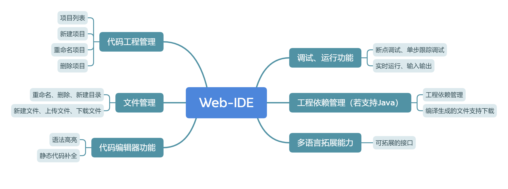
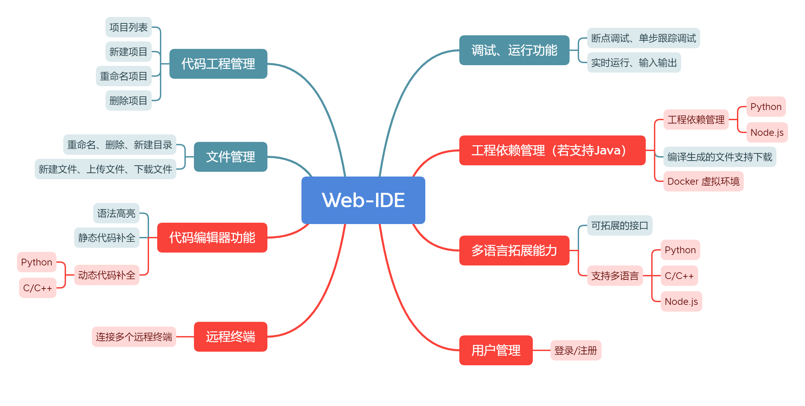
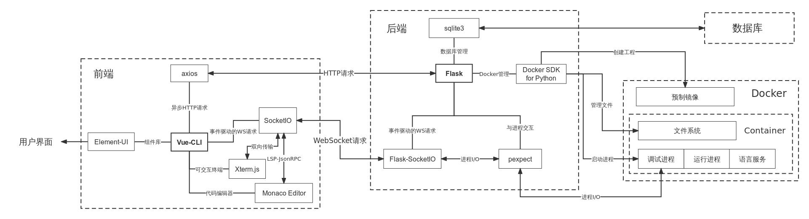
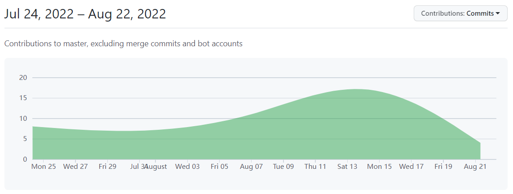
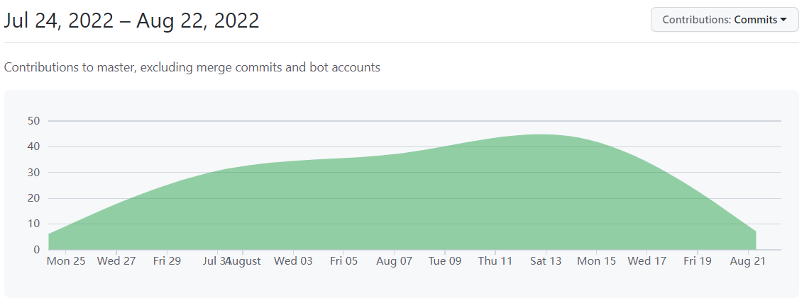

老师同学们大家好，我们组的选题是Web集成开发环境的实现。我们在完成了全部基础要求之外，还完成了一些附加功能。

我们的汇报将分以下五部分进行。

### 概述

（调整一下顺序，先讲需求分析、完成的基础功能点、额外完成的内容，再实际演示）

#### 需求分析

拿到作业文档后，我们做的第一件事就是整理需求，完成需求分析。我们根据作业文档与对其它市面上存在的在线IDE的调研，将需求划分为6点，包括：代码工程管理、文件管理、代码编辑器、调试运行、工程依赖、多语言拓展能力。

#### 完成情况

最终我们不仅完成了需求中的基础功能，还额外完成了Docker虚拟环境，动态代码补全，多语言支持，远程终端等额外功能。下面我们将演示一下项目的实际完成情况。

### 功能演示

（）

### 项目架构

接下来介绍项目架构。

（接下来的几页PPT就在这张图上移动，并且可以弹出一些文字和讲的内容对应）

#### 整体架构

宏观上我们将项目划分为四个模块：前端、后端、数据库、Docker，它们之间的关系如图所示。接下来我们将一一介绍每个部分的组成。

#### Docker

首先是docker。我们借助docker创建虚拟环境，使得每个工程具有一个独立的docker container，并为用户提供了操作docker终端的界面。它一方面借助不同镜像和使用dockerfile配置好的环境，保障了每个项目具有独立且互不干扰的环境，同时也便于依赖管理；另一方面，所有工程都放在非特权模式的container中，可以防止服务器被恶意代码或指令攻击，提高了安全性。除此之外，不同工程共享镜像，对服务器内存占用少；而且，用户离开container后，container将被关闭，所有运行在container中的线程，包括打开的终端、语言服务、调试器都被销毁，有利于资源的生命周期管理，避免内存泄漏。最后，由于docker只需要通过下载不同的镜像即可获得不同的虚拟环境，因此我们的项目天然地具有多语言扩展能力。

#### 前端

其次是前端。前端以vue-cli为核心，借助element-ui组件库实现美观且友好的用户界面，同时借助axios与SocketIO两个模块与后端进行通讯。其中，axios用于异步HTTP请求，而socketIO基于Websocket协议，可以替代HTTP请求完成实时性较强的通信。在本项目中，用xterm.js实现的可交互终端，用monaco editor实现的代码编辑器，以及用element-ui实现的调试器，都采用了socketio的通信方式。这是因为终端、调试器、语言服务等对响应速度地要求很高，实时性很强，一点点延迟的改善都可以极大地提升用户体验。值得一提的是，我们还实现了代码编辑器动态代码补全等功能，方法是使用LSP标准，对接语言服务，只要正确配置LSP的JsonRPC接口，把支持LSP的编辑器与支持LSP的语言服务连接起来，就可以为代码编辑器添加动态代码补全、代码格式化等功能。

#### 后端

其次是后端。后端以Flask为框架，主要处理前端的HTTP请求和Websocket请求。对于HTTP请求的项目、文件等内容，后端通过访问数据库和docker对数据进行增、删、改、查。剩下一些实时交互的功能，后端主要通过产生子进程，通过socketio进行数据通信。终端界面、运行界面等所需功能，后端使用popen模块产生子进程，并连接到子进程的标准输入输出；调试功能，我们利用针对python的remote_pdb与针对C/C++的gdbserver，将输入/输出进程与程序运行进程分离，并借助pexpect产生子进程，并读取分析终端输出的内容，再传输给前端。

#### 数据库

数据库部分，我们主要利用轻量级关系型数据库sqlite3，建立用户表和项目表两张表，其中用户与项目是一对多的关系。

### 工程管理

在工程管理方面，我们采用github管理代码，分为前端、后端、文档3个仓库。文档仓库中储存五次会议的会议记录等和API、数据结构等过程文档。同时，我们还进行了测试与持续集成，使用Github Actions，在每次提交代码时自动检查代码风格，并配置环境自动运行测试。开发过程中，我们配置了开发服务器，所有组员均可以连接到服务器，从而有效避免了运行环境不一致带来的诸多问题。最终从commit曲线上看，我们规划和分配的时间较为合理，并没有出现后期集中赶工的现象。

### 分工

下面是我们的成员分工明细。

| 人员 | 工作                                                         |
| ---- | ------------------------------------------------------------ |
| hjx  | 前端：登录/注册页面、主页、IDE页面。后端：语言服务。项目管理。 |
| xhb  | 后端：数据库、Docker交互、终端、调试/运行、API文档。         |
| djk  | 后端：登录/注册、依赖项管理、测试、API文档。                 |
| zrq  | 前端：原型设计，调试UI。                                     |

### 结束页

这就是我们所要展示和介绍的全部内容，谢谢大家！